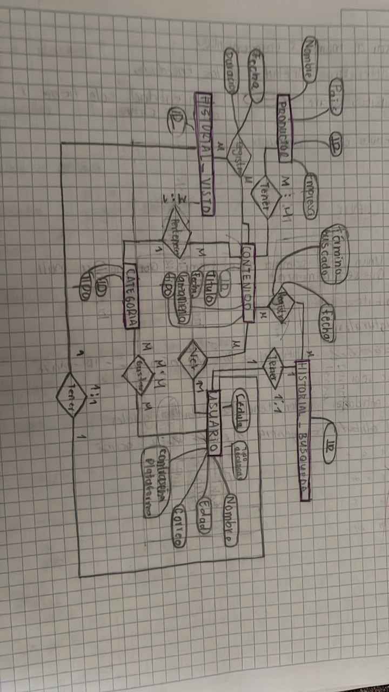

En las últimas clases aprendimos el concepto de el Mmdelo entidad relación y lo aplicamos a ejercicios propuestos por el profesor. Este es uno de los ejemplos realizados.

## ¿Qué es el modelo entidad relación?

El modelo entidad relación nos permite planificar como quedara nuestra base de datos, para que sea funcional y optimizada.

Los elementos que constituyen el modelo entidad relación son:

Entidades
Atributos
LLaves Primarias
Relaciones
Cardinalidades
## Entidades y relaciones

- **Productor – Contenido**: un productor puede tener varios contenidos, y un contenido puede tener varios productores (M:N).
- **Historial_Búsqueda – Contenido**: registra los contenidos buscados.
- **Historial_Búsqueda – Usuario**: cada usuario tiene un historial de búsqueda (1:1).
- **Historial_Visto – Contenido**: registra los contenidos vistos.
- **Historial_Visto – Usuario**: cada usuario tiene un historial de vistos (1:1).
- **Usuario – Contenido** (Ver): un usuario puede ver varios contenidos, y un contenido puede ser visto por varios usuarios (M:N).
- **Usuario – Contenido** (Gustar): un usuario puede marcar como favoritos varios contenidos, y un contenido puede gustarle a varios usuarios (M:N).
- **Contenido – Categoría**: un contenido pertenece a una o varias categorías.
- **Usuario – Categoría**: un usuario puede buscar dentro de varias categorías (M:N).

## Decisiones de diseño

Explica alguna decisión importante que tomaste al modelar (por ejemplo, por qué separaste una tabla, o cómo resolviste una relación muchos-a-muchos).

## Ejemplo de trabajo

Aquí describes brevemente qué muestra esa imagen (el ejercicio que resolviste).

## Conclusión

Cierra con qué aprendiste haciendo este trabajo, o qué le añadirías si lo siguieras desarrollando.